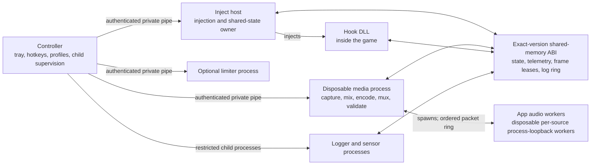

# CaptureEngine

Game capture, recording, overlays, graphics overrides, and frame pacing for Windows.

CaptureEngine records game video and multiple audio sources to Matroska files. It supports non-injected Windows
Graphics Capture (WGC) and DXGI Desktop Duplication as well as an injected, API-aware capture path. The project includes
custom overlay renderers, constant-frame-rate scheduling, hardware encoding, per-application profiles, and native FPS
limiter integrations.

The capture, overlay, synchronization, and pacing code is developed in this repository. FFmpeg provides codec and
container support, while Windows and GPU-vendor APIs provide the platform interfaces. The overlay and its frame-time
graph are rendered entirely by first-party code with no third-party overlay or UI library — no Dear ImGui or
anything similar.

## Support

[](https://github.com/sponsors/aufkrawall)

Sponsorships help with development time, hardware, and tooling. My other open-source projects would also profit
from donations; they are listed in [Other projects](#other-projects) at the bottom of this page.

## Contributing

Pull requests are currently disabled. This may change once a viable workflow with LLM-agent-based PR reviews is in
place. Bug reports and other feedback remain welcome — see [Bug reports and support
expectations](#bug-reports-and-support-expectations).

## Highlights

- WGC, DXGI Desktop Duplication, and injected capture, with video routing and DLL injection configured independently
- D3D9 through D3D12, Vulkan, OpenGL, and DXVK-aware hook and transport paths
- NVENC, AMD AMF, Intel Quick Sync/oneVPL, and Media Foundation encoders
- Native HDR video and screenshots, with optional HDR-to-SDR tone mapping for either output
- Multiple system-output, microphone, and per-application audio sources, with routing and mixing into separate tracks
- Custom DX9-DX12, Vulkan, and OpenGL overlays with HDR-aware rendering and DLSS/FSR frame-generation integration
  and NVIDIA Smooth Motion status, plus a non-injected desktop recording indicator for WGC/DXGI sessions
- General FPS limiting and recording-aware capture sync through a local timer or NVIDIA Reflex
- Forced anisotropic filtering, mip filtering/bias, queue-depth controls, V-Sync overrides, and selected DLSS overrides
- Session-scoped diagnostics, crash/freeze dumps, archived matching symbols, and automated capture analysis
- Best-effort privacy blackout for WGC/DXGI capture while the captured target is not focused fullscreen
- Fail-closed configuration/IPC validation with fuzz-tested parsers, secure DLL loading, and restricted child processes

## Requirements

- Windows 10 1803 or newer for WGC capture. Per-application audio through the process-loopback API additionally
  requires Windows 10 build 20348 or newer, or Windows 11.
- A GPU and driver that provide the selected hardware encoder (NVENC, AMD AMF, Intel Quick Sync/oneVPL, or Media
  Foundation). CaptureEngine never silently switches encoders; if the selected encoder is unavailable, encoding fails
  with a clear log entry.
- Administrator rights are not required for normal use. Some `[Performance]` options (for example `high` or
  `realtime` GPU scheduling priority) may require them.
- MKV is the default and the only actively tested container. MP4 and MOV are available as compatibility options.
- An x64 host. 32-bit games are supported through the x86 compatibility hook.

## Quick start

Unpack the release folder and start `CaptureEngine.exe`. On first run it creates `config.ini` next to the executable;
an existing file is never overwritten. The generated file is the full user reference and ends with safe/unsafe
application-profile examples.

Default hotkeys: Ctrl+9 starts/stops a recording (F9 is the fallback if the hotkey is disabled), Ctrl+8 toggles the FPS
display, Ctrl+0 takes a screenshot, and Ctrl+Minus records audio only. Recordings and screenshots go to `captures/`
and `screenshots/` next to the executable unless `[Output]` redirects them; logs go to `logs/`. Run
`CaptureEngine.exe --list-monitors` to print copyable stable monitor IDs for `monitor=id:<stable-id>`.

The default configuration records through WGC or DXGI Desktop Duplication without injection, and the non-injected
desktop overlay can show recording status while those paths are active. Before enabling injected capture, overlays, or
graphics overrides with any software, read [Anti-cheat safety](#anti-cheat-safety) and the profile examples at the end
of `config.ini`.

## Anti-cheat safety

> [!WARNING]
> Any feature that depends on CaptureEngine's injected hook DLL should be treated as unsafe with anti-cheat software.
> This includes injected capture, the injected overlay, graphics and DLSS overrides, and FPS limiting. WGC or DXGI
> capture is non-injected only when the selected profile does not enable injection for another feature.

CaptureEngine's `dlss_sr_dll_path`, `dlss_rr_dll_path`, `dlss_fg_dll_path`, and `streamline_dll_path` settings are
implemented through CaptureEngine's injected hook. Do not confuse them with NVIDIA's official DLL-override feature:
CaptureEngine's implementation does not use NVIDIA's supported override mechanism and does not inherit its anti-cheat
safety properties.

For software protected by anti-cheat, start with WGC or DXGI Desktop Duplication and explicitly set
`dll_injection=never`. This is the likely-compatible configuration, not a universal guarantee. Before configuring a
game, read the [safe and unsafe application-profile examples near the end of
`config.ini`](captureengine/config.ini.template#L621-L663).

## Multi-process architecture

`CaptureEngine.exe` runs several internal roles. Keeping capture, media processing, telemetry, and control in separate
processes limits failure propagation and lets recording finalization finish without blocking tray or hotkey handling.



- **Controller:** owns the tray UI, hotkeys, configuration/profile selection, session identity, and child supervision.
- **Inject host:** owns the discovery/shared-memory contract, injects the hook DLL, and publishes resolved per-process
  configuration.
- **Hook DLL:** intercepts graphics and frame-generation APIs inside the target, renders the injected overlay, publishes
  GPU frame leases, and runs latency-sensitive pacing locally.
- **Media process:** is disposable per recording. It owns WGC/DXGI capture when selected, audio capture/mixing, encoding,
  muxing, post-write validation, and the recording's immutable diagnostic files. System-output and microphone sources
  are captured in-process through WASAPI loopback/input devices.
- **Logger and sensor processes:** consume the shared ABI for hook logs and CPU/GPU/RAM/VRAM telemetry without putting
  that work on the game's render thread.
- **App audio workers:** per-application process-loopback capture runs in disposable CaptureEngine worker processes
  spawned by the media process. The AudioSes COM graph stays out of the long-lived media process; only ordered packet
  records cross a private shared-ring/event boundary, and workers are recycled on target-process or activation
  lifecycle changes.
- **Limiter process:** provides the optional process-side limiter role; basic and fallback timer cadence itself remains
  hook-local, so it does not pay a cross-process round trip per frame.

Controller-to-inject/media/limiter commands use a unique duplex named-pipe channel per child. Only the child's pipe
handle is inherited, the channel is restricted to the current user and SYSTEM, and startup authenticates the exact
child PID, role, protocol, sequence, and a random 128-bit nonce. The high-volume shared-memory path is an exact,
versioned ABI with size and layout fingerprints; mixed or stale binaries fail closed instead of reading shifted frame
or telemetry fields.

## Capture paths and GPU transport

- **WGC:** the default non-injected window-capture path. It uses
  `Windows.Graphics.Capture`, works with DirectFlip content, and is generally the safer choice for software that does
  not permit injection. This is not a universal anti-cheat compatibility guarantee; use a profile with
  `dll_injection=never` where injection must be excluded.
- **DXGI Desktop Duplication:** non-injected monitor capture with explicit source-delivery and duplication-pressure
  diagnostics. It can fall back to WGC for the same selected monitor when necessary.
- **Injected capture:** intercepts Present/swap-chain paths and publishes frames directly from the game process. The
  injected overlay and graphics overrides can also be used while WGC or DXGI remains the selected video source.

The principal capture-to-encoder paths keep frames GPU-resident wherever the API and driver allow it:

| Source API | Transport |
| --- | --- |
| D3D9Ex | Asynchronous GPU blit to shareable textures, imported by D3D11 |
| Classic D3D9 | Opportunistic native sharing; otherwise GPU→CPU readback staging or GPU-based WGC fallback |
| D3D10/11 | Shared D3D11 textures with query/fence and lease ownership |
| D3D12 | Shared resources/fences through the D3D11 hardware-frame handoff |
| Vulkan and DXVK | Encoder-owned KMT textures imported into Vulkan |
| OpenGL | GPU interop transport |

“GPU-resident” does not mean that every backend performs literally zero GPU copies. Format conversion, an asynchronous
GPU blit, or the final encoder-surface handoff can still be required. The important boundary is avoiding a
GPU-to-CPU readback followed by a CPU-to-GPU upload in the normal hardware path. Classic D3D9 devices are deliberately
not promoted to D3D9Ex because that changes resource, reset, presentation, and COM behavior.

Classic D3D9 is the path where that boundary is commonly crossed, and capture performance is usually much worse than
with D3D9Ex. D3D9Ex capture stays GPU-resident: an asynchronous GPU blit publishes shareable textures that D3D11
imports directly. Classic `Direct3DCreate9` devices, in contrast, usually cannot create or open shared resources on
current drivers (NVIDIA x64/x86 probes return `D3DERR_INVALIDCALL` despite advertised caps), so sharing is only
opportunistic. When sharing fails, injected capture falls back to a D3D11 staging path: GPU `StretchRect`, a deferred
GPU→CPU readback after Present, `LockRect`, and a CPU→D3D11 upload. The readback is deferred so Present itself is not
blocked, but the per-frame CPU/GPU work remains; at high resolutions and frame rates (for example 4K/120) this is
really slow and can severely affect game performance. GPU-based WGC capture is the preferred no-readback alternative
when sharing is unavailable. For old classic-D3D9 games, running them through DXVK is therefore recommended:
D3D9-under-DXVK is captured through the Vulkan layer's GPU-resident transport instead of the readback staging path.
Native D3D9Ex applications already get the fast GPU-only path without DXVK.

## Privacy

- **[Capture] black_when_no_fullscreen_focus:** best-effort privacy blackout for WGC and DXGI capture. While the
  selected window is not focused and fullscreen-like, output video is opaque black, including cursor and overlays.
  The check uses passive window-state APIs only; it never inspects or injects into the captured application, and
  Windows focus/bounds detection is not 100% reliable, so this is not a guaranteed redaction boundary.
- **Logs and dumps:** session logs, manifests, and crash dumps can contain process names, paths, window titles,
  memory, or other private data. Review them before sharing; see
  [Debug logging and crash dumps](#debug-logging-and-crash-dumps).

## Video, screenshots, and audio recording

- **HDR video:** `[Video] color_space=auto` preserves a detected HDR source as BT.2020/PQ through supported HEVC or
  AV1 hardware encoders. Selecting `[Video] color_space=bt709` instead performs an actual HDR-to-SDR tone and gamut
  map; it does not merely relabel HDR pixels as SDR. The conversion is calibrated from the Windows SDR-white setting.
- **Screenshots:** screenshots can come from the active injected capture path or from the out-of-process WGC fallback.
  With `[Screenshot] color_space=auto`, SDR is saved as PNG and HDR is preserved as 10-bit 4:4:4 BT.2020/PQ AVIF.
  Selecting `[Screenshot] color_space=bt709` tone-maps HDR to a conventional SDR PNG independently of the video
  setting.
- **Audio recording:** recordings can contain video plus audio or be audio-only. CaptureEngine supports multiple
  system-output, microphone, and per-application loopback sources; each source can feed one or more tracks, and sources
  sharing a track are mixed. AAC, ALAC, FLAC, Opus, and PCM are supported.

## Smooth CFR video and exact A/V endpoints

The CFR media clock is authoritative. CaptureEngine does not derive file timing from whichever frames happened to
arrive:

- Output timestamps follow an immutable rational CFR grid. Matroska uses 1 microsecond timestamp precision, so 120 FPS
  intervals are represented as 8,333/8,334 microseconds instead of being quantized to 8/9 milliseconds.
- WGC and DXGI keep a bounded source-history reservoir and choose the nearest monotonic source frame for each scheduled
  content timestamp. Startup can briefly pre-fill the reservoir after prewarm so the first live seconds do not start
  with avoidable repeats. Inject capture uses the same nearest-timestamp principle with a smaller, GPU-native queue.
- Game hitches and mismatched source rates are represented by evenly placed repeats or decimation. A repeated desktop
  frame can still re-render a newly positioned hardware cursor.
- DXGI pointer-only acquisitions carry their own exact-QPC cursor history, so hardware-cursor motion stays smooth even
  when desktop content updates slowly. Cursor positions are selected at the same delayed content target as the frame,
  and repeats re-render the current cursor without full-frame copies, readbacks, or software-cursor substitution.
- Encoder overload never authorizes skipping CFR packet slots or accelerating audio. The scheduler preserves the
  output grid with cached repeats and, when safe, grid-matched historical frames. Measured fresh/repeat service time
  controls how aggressively recovery can run without creating another overload oscillation.
- Inject producers never wait in Present for a busy transport slot. A busy ring drops that source frame safely; the
  media scheduler closes the CFR slot using the last valid frame.
- Finalization derives every audio target from the final CFR frame count. The completed file is reopened, video packet
  coverage is checked for gaps, and every audio stream is decoded to verify the exact target sample count and identical
  endpoints across tracks.

Windows provides no API that can guarantee a recorder a fixed allocation of hardware video-encoding resources.
CaptureEngine can preserve CFR and audio-sync correctness through transient pressure, but it cannot force a saturated
GPU, video engine, memory path, or driver queue to finish encoding on time. B-frames, lookahead, multipass encoding,
and higher-quality presets increase this pressure. Sustained encoder overload therefore cannot be fixed inside
CaptureEngine: lower the game's GPU load or frame-rate limit, or reduce encoder complexity and quality settings—most
notably B-frames, lookahead, and multipass.

Audio uses WASAPI loopback for system outputs and the Windows process-loopback API for application audio. Each source
has a timeline-aware float ring, and sources sharing a track are mixed before a soft-knee limiter that leaves ordinary
in-range samples bit-exact. Sparse application sources contribute source-local silence instead of blocking a mixed
track.

Audio is never cut, broadly pitch-shifted, or moved earlier to catch up with video pressure. An adaptive ingestion
reservoir absorbs delivery jitter without changing where samples land on the timeline. A very small source-clock
resampler correction is available only on a settled, healthy timeline and is capped at 0.05%; it is disabled during
startup protection, force drain, source loss, or encoder/timeline shortfall.

## FPS limiter internals

Capture sync can limit an injected application's rendered rate to a multiple of the recording rate—for example,
120 rendered FPS for a 60 FPS recording. General limiting works independently of recording.

| Mode | Internal path |
| --- | --- |
| Basic | Hook-local rational-QPC timer cadence |
| Reflex | NVIDIA Reflex sleep-mode/low-latency integration, with game-owned sleep handoff when stable |
| FG fallback | Timer cadence scaled to the confirmed frame-generation multiplier |
| Auto | Game-activated Reflex → FG fallback → Basic |

Reflex integration resolves `NvAPI_D3D_SetSleepMode` and `NvAPI_D3D_Sleep` from `nvapi64.dll` and calls the original
entry points directly. CaptureEngine deliberately does not patch NvAPI code bytes, because some DLSS FG integrations
validate those prologues during Reflex setup. The driver's `minimumIntervalUs` is pushed to enforce the cap, and once
the game's own Reflex sleep loop is confirmed stable, pacing hands over to the game-owned sleep path.

The timer path uses a Bresenham-style rational QPC grid rather than rounding every frame to one integer tick interval.
The exact fractional remainder is accumulated instead of being truncated, so fractional target rates stay correct and
the cadence remains phase-locked to the CFR selector over long runs. Missing a deadline never produces a short
catch-up frame; the limiter skips whole grid slots, counts them, and continues on the next grid deadline.

Waiting is a hybrid sleep/spin strategy: timer resolution is raised with `timeBeginPeriod(1)`, a high-resolution
waitable timer (Windows 10 1803+) is armed early, the fine-wait margin adapts from the observed p99 wake overshoot,
and a tight spin is used only for the final 50 microseconds. This keeps idle CPU use low while still landing on the
grid.

Capture-sync recovery advances by whole grid slots until the next deadline has useful headroom, preserving phase with
the CFR selector after a hitch. Re-entrant or concurrent Present calls cannot advance the same cadence twice: one
caller owns it and the others return without blocking. With frame generation, WGC/DXGI target the final presented
rate, while injected capture targets the application's real rendered frames.

## Overlay and frame generation

The overlay has custom renderers for DX9-DX12, Vulkan, and OpenGL, a custom font rasterizer, and precompiled shaders;
the frame-time graph is drawn by the same custom renderer and shader set.
Its layout and font rendering support automatic Windows per-monitor DPI scaling, including fractional scale factors.
It tracks presentation color space so SDR, scRGB, and HDR10 targets receive the appropriate transfer/gamut handling,
so native HDR does not look oversaturated or washed out; texture format alone is not treated as proof of HDR.

The frame-time graph scales its vertical ceiling dynamically instead of using a fixed 0-to-X axis: the ceiling
follows the recent average and minimum with at least 50% headroom above the average, a minimum 33 ms range so the
30 FPS threshold stays visible, and padding below the lowest samples so the line stays vertically centered. The
current ceiling is shown as a small scale marker next to the graph and refreshes at most every two seconds to avoid
flicker.

DLSS Frame Generation integration observes NVIDIA Streamline and NGX through inline, wrapper, dynamic-resolution, and
direct-import seams. FSR Frame Generation integration observes FidelityFX context/configuration state and the
application's present-callback contract. Explicit transition state machines and trace-replay tests cover off, DLSS FG,
and FSR FG switching without intentionally blanking the overlay. Real compatibility still depends on the game,
runtime, driver, other injected overlays, and transition sequence; no README claim can guarantee every combination.

NVIDIA Smooth Motion is recognized alongside DLSS and FSR frame generation, and the FG status line follows the same
transition state machines.

For non-injected WGC or DXGI sessions, a small desktop overlay window can show recording state, a NOT RECORDING warning
when the configured target is not being captured, and live encoder-overload/recovery/degraded health warnings. It is a
separate corner window that never requires the hook DLL; see `[DesktopOverlay]` in `config.ini`.

## Known issues and limitations

The following issues are currently known. They are not hidden by the feature descriptions elsewhere in this
document:

- The frame-generation overlay indicator can show a stale FPS value in some configurations.
- The overlay can have issues after frame-generation switching sequences (for example switching between DLSS
  Frame Generation and FSR Frame Generation). Recovery is not guaranteed in every game, runtime, driver, and
  transition-sequence combination.
- Smooth capture with DLSS 4.0+ frame generation is hard to fix and possibly impossible with the currently
  available public interfaces, because frame pacing there is largely controlled by the game, Streamline, and the
  driver rather than by CaptureEngine.
- Classic D3D9 inject capture commonly falls back to a GPU→CPU readback staging path, which is slow at high
  resolutions and frame rates (for example 4K/120) and can severely affect game performance. Running the game through
  DXVK avoids this staging path; native D3D9Ex is already fast without DXVK. See
  [Capture paths and GPU transport](#capture-paths-and-gpu-transport).

## Anisotropic filtering and sampler overrides

Forced AF follows each graphics API's native sampler model. It is not one generic per-draw replacement hack:

| API | Implementation |
| --- | --- |
| D3D6-9 | Reconciles mutable texture/sampler state on state changes, config changes, and state-block application |
| D3D10 | Modifies immutable sampler descriptors once at creation and retries the original descriptor if rejected |
| D3D11 | Uses pixel-shader/SRV-aware dirty-slot replacement; a clean draw performs only a version/dirty check |
| D3D12 | Covers dynamic samplers plus static samplers in root signatures 1.0-1.2 at creation time |
| Vulkan | Applies policy at `vkCreateSampler`, clamps to device limits, and transactionally retries the original |
| OpenGL | Reconciles texture/sampler parameter, storage, mip-generation, and cached bind events without a draw hook |

Safe mode preserves structurally special samplers such as comparison/reduction, border, fixed-LOD, non-mipmapped, and
other API-specific unsafe cases. Aggressive mode broadens ordinary material coverage without opting protected sampler
families in. D3D10, D3D12, and Vulkan have no bind/draw overhead after sampler creation; legacy APIs and OpenGL do only
event-driven bookkeeping. Decisions, retries, bootstrap failures, and summaries are rate-limited in the debug logs.

## Encoding and FFmpeg patches

Video/audio encoding and Matroska muxing use FFmpeg (`libavformat`, `libavcodec`, `libavutil`, and `swresample`).
Hardware-frame paths are available for NVENC, AMD AMF, and Intel Quick Sync/oneVPL. HDR recording uses an explicit
BT.2020/PQ signaling contract across codec frames, bitstreams, and the container rather than inferring HDR from an
FP16 or 10-bit texture.

Backend behavior is explicit rather than emulated:

- NVENC HEVC/AV1 can split each frame across multiple physical encoder engines while still producing one ordinary
  stream (`[NVENC] split_encode=0..4`); H.264 never splits.
- Quick Sync derives its encoder and dynamic-frame context from the exact capture D3D11 device and maps surfaces
  directly, with no VAAPI layer or CPU frame transfer. AMF consumes the D3D11 hardware pool directly.
- Media Foundation is a deliberate NV12/SDR compatibility fallback and does not carry HDR. H.264 HDR fails closed;
  HDR sources require HEVC or AV1.
- HDR signaling is one explicit contract: BT.2020-NCL/PQ, limited range, top-left co-sited 4:2:0 (Rec.2100 chroma
  phase), and a nominal peak (default 1000 nits, `hdr_nominal_peak_nits`) written consistently to the codec context,
  frames, container, and HEVC/AV1 headers. AV1 NVENC's unsafe SMPTE ST 12-1 timecode path is disabled.

See [patches/ffmpeg/README.md](patches/ffmpeg/README.md) for the exact patches:

- Configurable Matroska timestamp precision, including duration/default-duration scaling and safe cluster rollover
- Deterministic NVENC lookahead/AQ disablement, capability-aware B-reference resolution, additional picture-type
  mapping, and an AV1 B-frame maximum-QP control

## Debug logging and crash dumps

Each run receives a timestamped session directory. It contains a controller manifest, per-process logs, performance
metrics, and immutable recording-specific media logs/manifests, so a later recording cannot overwrite the evidence for
an earlier one.

Session directories live under `logs/` next to the executable; crash dumps can be redirected with
`[Logging] crash_dump_dir`. Recordings are staged under a reserved name and renamed to their final name only after the
mux trailer is written, the duration is positive, and at least one video packet exists; interrupted or failed
recordings therefore never publish a partial or header-only file. Each recording carries an immutable manifest with
its final status, health state, and timeline debt.

The hook publishes bounded log records through a lock-free shared ring to the logger process. Hot paths use
rate-limited state-transition, ownership, and failure diagnostics rather than unbounded per-frame noise. Depending on
the configured log level, the resulting evidence can reconstruct:

- capture-backend selection and DXGI-to-WGC fallback history
- source starvation versus copy-pool, GPU-fence, media-CPU, mux, or encoder pressure
- CFR selection, repeats, phase lock, visual debt, timer overshoot, and limiter mode changes
- audio source epochs, delivery headroom, reservoir changes, drift correction, mixing, and final sample accounting
- DLSS/FSR state transitions, swap-chain/queue ownership, overlay routing, and slow DX12 Present/command-list phases
- post-mux packet coverage, codec padding, decoded audio endpoints, and finalization failures

Crash handling writes dumps through an out-of-stack worker with richer thread, unloaded-module, handle, process/thread,
and memory metadata where the target permits it, then falls back to more compatible dump types if necessary. The
injected hook also has a freeze watchdog that can capture the monitored thread's context for hangs, blocking dialogs,
and selected GPU-removal paths without immediately terminating the game. Successful external
`MiniDumpWriteDump` calls made by a game/runtime crash handler can be mirrored into the active session, covering crash
families that bypass CaptureEngine's unhandled-exception filter.

The freeze watchdog scales its timeout to the detected engine/runtime class (for example Unreal Engine 5 or DLSS
frame generation), and the crash handler also covers recoverable execute faults such as lazy trampoline-pool DEP
faults. Repeated identical external dump storms terminate the crashing process with a dedicated exit code instead of
generating an endless dump sequence.

Windows builds emit PDBs, and every session snapshots the matching CaptureEngine PE/PDB set beside its dumps. A dump
therefore remains symbolizable after a newer build has replaced the installed binaries. CDB, WinDbg, or Visual Studio
can resolve both those archived local symbols and Microsoft system symbols. DX12 device-removal diagnosis can
additionally use opt-in DRED breadcrumbs/page-fault data and the built-in command-queue/overlay timing diagnostics.

Logs and dumps may contain process names, paths, window titles, memory, or other private data. Review them before
sharing.

## Configuration

There is no separate usage wiki. The generated `config.ini` is the user reference: it documents every normal option,
valid values, safety notes, and complete application-profile examples. The authored source is
[captureengine/config.ini.template](captureengine/config.ini.template), and its exact contents are embedded into
CaptureEngine for first-run creation.

If anti-cheat is involved, consult the safe/unsafe examples at the end before enabling a profile. The decisive boundary
is whether CaptureEngine loads its hook DLL, not whether video itself comes from WGC, DXGI, or injected capture.

An existing `config.ini` is never silently merged or replaced. When updating an older installation, compare it with
the current template for newly added settings and examples.

## Build system

[build.py](build.py) is the single orchestration entry point for dependency preparation, compilation, testing,
analysis, binary verification, and packaging. On Windows it manages a project-local MSYS2 `clang64` environment,
which supplies the package manager, Clang/LLD, build tools, headers, and libraries. MSYS2 is the controlled build
environment; CaptureEngine itself is built as native Windows PE executables and DLLs and does not need to be launched
through an MSYS shell.

The build covers the x64 application and hook, the x86 compatibility hook, MediaEngine, both Vulkan layers, shaders
and resources, the native graphics test applications, and the unit-test binaries. Shipping files are staged under
`installed/captureengine`; validation-only programs remain under `installed/testapp`. After binary verification, a
product build atomically replaces `build/packages/captureengine.7z` and `build/packages/testapps.7z`. The product
archive contains a clean `captureengine/` folder without local logs, captures, backups, stale files, or the current
user configuration. The separate `testapps/` archive contains only first-party executables/PDBs plus a runtime note;
it does not redistribute the FSR, Streamline, DLSS/NGX, Reflex, or driver DLLs staged for local validation.

Dependency handling is deliberately reproducible and fail-closed. The MSYS2 bootstrap is authenticated using its
detached signature and a pinned signing key. Source packages and upstream archives are checked against pinned
signatures, fingerprints, and SHA-256 hashes, then the FFmpeg dependency closure and the project's customized FFmpeg
are built into a private prefix. Runtime DLLs are staged only from that prefix. Unexpected PE imports, missing
licenses, a changed patch/configuration fingerprint, or an unverifiable dependency cause a rebuild or a hard failure
instead of silently using an arbitrary system copy.

Incremental builds are content-validated rather than timestamp-based: an object is reused only when its source,
compiler binary, flags, dependency information, and project-header contents still match. Product binaries are
relinked with the exact new build identity, while reusable test links additionally validate every input and the
output hash. The build also emits `compile_commands.json`, uses strict floating-point semantics for sensitive audio,
timing, and color-conversion code, and verifies PE architecture, import closure, Control Flow Guard and other
mitigations, writable/executable section separation, shaders, CodeView records, and matching PDBs.

Useful contributor loops are:

```powershell
# Fast edit/test loop for one suite or test
python build.py --incremental --tests-only --run-tests --gtest-filter=<suite-or-test> --skip-updates --concise

# Normal completion gate
python build.py --incremental --skip-updates --concise
python build.py --no-build --run-tests --skip-updates --concise

# Complete clean gate for high-risk or build-system changes
python build.py --verify --skip-updates --concise
```

`--verify` is a nested all-in-one gate, not an extra step after the normal gate: it performs a clean product build,
the full native and Python test suites, content-addressed clang-tidy and file-size ratchets, and isolated ASan/UBSan
validation. On a cache miss, the sanitizer build runs concurrently with the clean product build in separate output
roots. `--skip-updates` keeps routine development on the already verified dependency set; stale or missing outputs
are still rebuilt. `--concise` keeps the terminal readable while preserving complete commands and subprocess output
in the detailed build log. A plain `python build.py` uses the managed default-quality path and may refresh MSYS2 and
source-built dependencies when required.

## Testing

The repository contains GoogleTest coverage for capture scheduling, audio timing and codecs, FPS limiting,
frame-generation transitions, shared-memory/IPC validation, graphics overrides, crash-dump policy, mux invariants, and
configuration parsing. Native x86/x64 test applications exercise DirectDraw, D3D6-D3D12, OpenGL, Vulkan, frame
generation, and deterministic A/V markers. The verification pipeline also checks tool self-tests, static analysis,
sanitizers, PE hardening/architecture, import closure, and PDB availability.

Robustness is exercised beyond unit tests: libFuzzer harnesses fuzz the configuration parser and IPC deserializer
against byte-exact seed corpora (`build.py --run-fuzz`), DX12 frame-generation transitions are validated with
trace-replay and transition-sequence tests, and the A/V sync matrix decodes finished recordings and correlates content
across the entire duration rather than only checking endpoints. ASan/UBSan validation runs in isolated output roots,
and clang-tidy/file-size findings are content-addressed and ratcheted so regressions cannot silently return.

## Technical notes

- **Interception:** the hook stack is custom rather than MinHook-based: IAT patching, vtable hooks, and
  trampoline-based inline detours for x64/x86 with an instruction-length decoder and deep hooks that wrap external
  JMP patches. Trampolines can be published before a target becomes live, and D3D9-D3D12/DXGI COM wrappers forward
  explicitly so raw vtable hooks cannot run the same logic twice.
- **Vulkan:** capture and overlay run as a real explicit Vulkan layer (`VK_LAYER_CE_overlay`, x86 and x64),
  registered per-user or all-users with both registry views, and bridge into the same shared-memory/IPC contract as
  the hook DLL. DXVK transport uses encoder-owned KMT textures with no CPU round trip.
- **Shared-memory ABI:** the layout is versioned (currently 38) and every field offset is mixed into a fingerprint
  hash, so mixed or stale binaries fail closed instead of reading shifted fields. Configuration reloads use sequence
  locks; the inject frame ring publishes only the longest contiguous completed prefix so out-of-order GPU work can
  never recycle encoder-owned textures; the log path is a bounded lock-free ring.
- **CFR and A/V:** an immutable rational output grid, exact-QPC DXGI cursor history, wall-anchored startup
  reservoirs, grid-matched historical-frame recovery, an adaptive audio ingestion reservoir, and a source-clock
  resampler correction capped at 0.05%. Finalization decodes every audio stream to verify exact endpoints, and the
  capture analyzer correlates full-duration content between tracks.
- **HDR color pipeline:** presentation color is tracked from swap-chain state (`SetColorSpace1`, `VkColorSpaceKHR`)
  instead of texture formats; overlay HDR10 draws transform Rec.709 to Rec.2020 before PQ using the Windows
  SDR-white calibration; HDR video output writes BT.2020-NCL P010 directly rather than relying on fixed-function
  conversion.
- **Crash and dump engineering:** rich minidump flags with automatic compatibility fallback, out-of-stack dump
  workers, an engine-aware freeze watchdog, mirroring of external `MiniDumpWriteDump` calls with storm protection,
  and recoverable execute-fault handling for lazy trampoline DEP faults.
- **Security:** DLLs load only from application, System32, and one private runtime directory—never the current
  directory or PATH; child processes inherit only explicitly listed handles; private channels are authenticated per
  child with a 128-bit nonce; config and IPC parsers are fuzz-tested and fail closed.
- **Scheduling:** capture/encoder workers use checked MMCSS QoS, D3D11 device priority is persisted, process
  scheduling priority resolves against the adapter's actual HAGS state, and sub-processes opt out of Windows 11
  power throttling to avoid jitter.

## Possible future work

These are exploratory directions, not promises or a release schedule. Items are only implemented if they prove
feasible:

- LibreHardwareMonitor integration for proper hardware sensor data in the overlay and session logs
- PresentMon plug-in support
- managed loading of OptiScaler, ReShade, or Special K DLLs as add-ons
- webcam overlay support (exploratory)
- investigating YouTube/Twitch live-streaming support
- XeSS frame generation support
- evaluating Unreal Engine settings overrides
- further capture, overlay-coexistence, encoder, and hardware-monitoring improvements discovered through testing

## Bug reports and support expectations

Useful, reproducible bug reports are welcome—especially with the relevant session logs, configuration, reproduction
steps, and dumps where available. Before uploading anything, check logs and dumps for private data such as process
names, paths, window titles, or memory contents, and redact or remove anything you do not want to share; see
[Debug logging and crash dumps](#debug-logging-and-crash-dumps).

Reports are usually addressed, but this is a free-time project with many remaining tasks: fixes may take a while,
and I cannot guarantee a fix, compatibility with every game/driver/runtime combination, or a response or timeline
for every report. Some reports may receive no individual reply even when the information is useful.

## Other projects

- [green-curve](https://github.com/aufkrawall/green-curve) — open-source GPU curve undervolting and overclocking
- [testsmem4u](https://github.com/aufkrawall/testsmem4u) — cross-platform RAM testing tool using proven patterns
- [Shader-Stress](https://github.com/aufkrawall/Shader-Stress) — CPU stress test with shader-compilation-like
  workloads
- [GreenPostInstallDebloatNative](https://github.com/aufkrawall/GreenPostInstallDebloatNative) — removes optional
  driver bloat after a regular installation
- [green-scripts](https://github.com/aufkrawall/green-scripts) — PowerShell scripts for various NVIDIA driver
  control panel features
- [DpcLatencyMon](https://github.com/aufkrawall/DpcLatencyMon) — Windows DPC latency monitoring
- [obs-indicator](https://github.com/aufkrawall/obs-indicator) — a low-overhead OBS recording-status indicator
- [mpv-winbuild-python](https://github.com/aufkrawall/mpv-winbuild-python) — Python script that builds `mpv.exe` at
  the push of a button
- [pybecrasher](https://github.com/aufkrawall/pybecrasher) — Python-based CPU stress test mimicking UE5 workloads

More projects are available on [my GitHub profile](https://github.com/aufkrawall?tab=repositories). All of these
projects would also profit from donations — see [Support](#support) at the top of this page.

## Disclaimer

CaptureEngine is provided "as is", without warranty of any kind, express or implied. You use it at your own risk
and are solely responsible for any consequences, including anti-cheat actions such as account bans in online games,
or damage to your system, data, or hardware. Injected features carry additional risk; see
[Anti-cheat safety](#anti-cheat-safety).

## License

CaptureEngine is licensed under the [MIT License](LICENSE). Bundled FFmpeg components and the FFmpeg patches retain
their applicable LGPL licensing; see [licenses/](licenses/) and [patches/ffmpeg/README.md](patches/ffmpeg/README.md).
